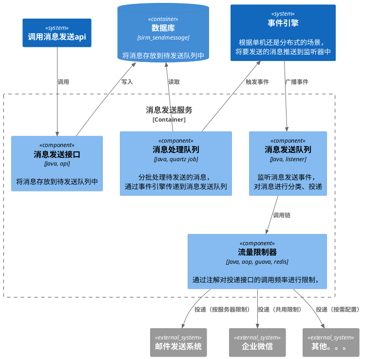
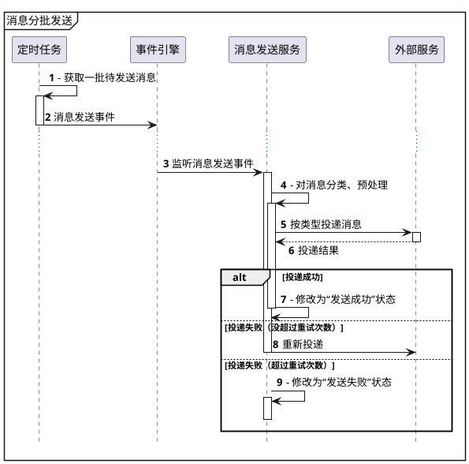
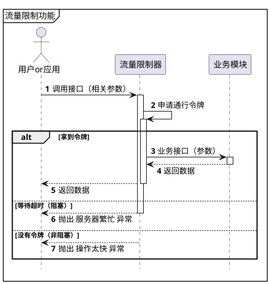

# 消息发送限流设计


# 引言

## 目的

业务相关操作会发送消息（邮件、短信、企业微信），目前是通过异步的方式去发送来达到性能上的优化。

然而相关的服务提供商，会有很多限制。例如邮件发送，可能会限制一个IP一分钟最多发送30个邮件地址；企业微信每应用不可超过帐号上限数*200人次/天，每应用对同一个成员不可超过30次/分钟，超过部分会被丢弃不下发。

在高并发场景下，系统不限制消息发送接口的调用，业务功能也正常，但是消息服务可能承受不住，因为短时间内可能就会发送几百、几万条消息，导致消息丢失。

为了保证消息的成功发送，就需要在发送消息这里做一下限制，针对不同的消息类型，做不同的限制。

另外，

## 变更历史

| 版本  | 内容         | 修改人 | 日期         |
| ----- |------------|-----|------------|
| 1.0.0 | 消息发送限流设计 | 霍智鹏 | 2022-08-08 |
|       |            |     |            |

## 术语和缩略语

| 名称 | 缩略语 | 说明  |
| ---- | ------ |-----|
|      |        |     |

# 模块描述

通过设置一定时间内最大的发送数量，对消息发送进行限流。


# 架构图





# 功能设计

## 消息发送

### 功能描述

对系统中的消息分批发送，避免短时间内发送大量消息冲垮相关的投递服务。

### 操作流程





### 业务规则

1. 在消息处理队列中：
    1) 如果缓存中的消息发送完，则跳过本次定时任务（springcache）
    2) 根据配置的大小，从sirm_sendmessage表中获取一批待发送的消息
    3) 将待发送的消息主键缓存起来
    4) 触发消息发送事件
2. 消息发送服务中
    1) 遍历要发送的消息
    2) 获取消息对应的发送实现（IMessageHandler）
    3) 通过线程池发送消息（限流器进行限流）
    4) 收集发送结果
        - 发送成功：状态修改为‘发送成功’，清除对应的缓存
        - 发送失败：如果没到重发上限，重发次数+1，消息重新加入发送队列尝试重发；如果达到重发上限，状态修改为‘发送失败’，清除对应的缓存
3.


## 限流器功能

### 功能描述

通过注解的方式，在不同的维度对接口的调用频率进行限制。

### 操作流程




### 业务规则


在需要进行限制的接口上，通过`com.sinitek.sirm.common.limit.SiniCubeLimiter`注解添加一个限流器。

```java
@SiniCubeLimiter()
public void sendEmail(){
    ...
}
```

**SiniCubeLimiter属性说明**

| 名称   | 字段       | 类型      | 必填  | 备注                                                 |
|------|----------|---------|-----|----------------------------------------------------|
| 限流维度 | mode     | 枚举类     | N   | METHOD、USER、SERVER、CUSTOM ， 默认使用 接口维度              |
| 频率   | rate     | Integer | Y   | 正整数，在配置的间隔时间内能够调用的次数                               |
| 间隔   | interval | Integer | Y   | 正整数，窗口期的时间，单位秒                                     |
| 阻塞策略 | blocking | boolean | N   | 调用达到上限时的策略，默认true阻塞，等到下一个窗口期。设置成false并且到达上限时，会抛出异常 |
| 超时   | timeout  | long    | N   | 自然数，阻塞时的超时时间，默认-1不超时，单位秒                           |


#### 限流的实现

通过spring aop对`@SiniCubeLimiter`注解进行切面，根据运行的环境应用不同的限流实现（单机模式：guava，分布式模式：redission）

1. 获取方法上@SiniCubeLimiter注解的配置，组装key获取限流器（springcache进行缓存，没有就新增并用相关参数初始化）

2. 通过限流器获取一个通行令牌（根据阻塞策略，没获取到令牌、等待超时 时抛出异常）

3. 成功获得令牌后，继续接口的调用。


**维度说明**

- 接口维度：默认，所有应用共享一个限制。
- 用户维度：不支持匿名调用，需要有当前登录人。根据用户来限制接口的调用。例如应用在防止表单重复提交。
- 服务维度：不同IP的应用服务，限制相互独立。例如用在邮件发送，提高效率
- 自定义维度：根据业务需求，自定义限制的维度。例如匿名访问的情况下，限制客户端访问频率，将`客户端标识`设置为自定义维度键即可。
